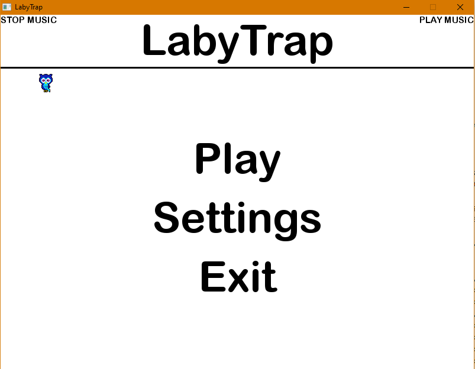
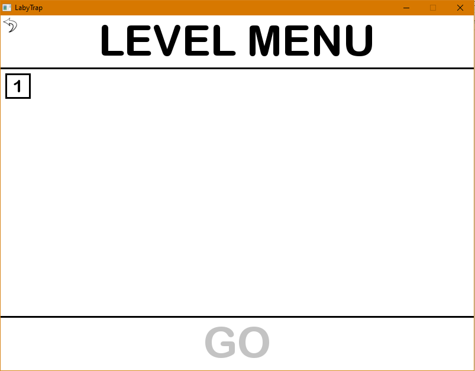
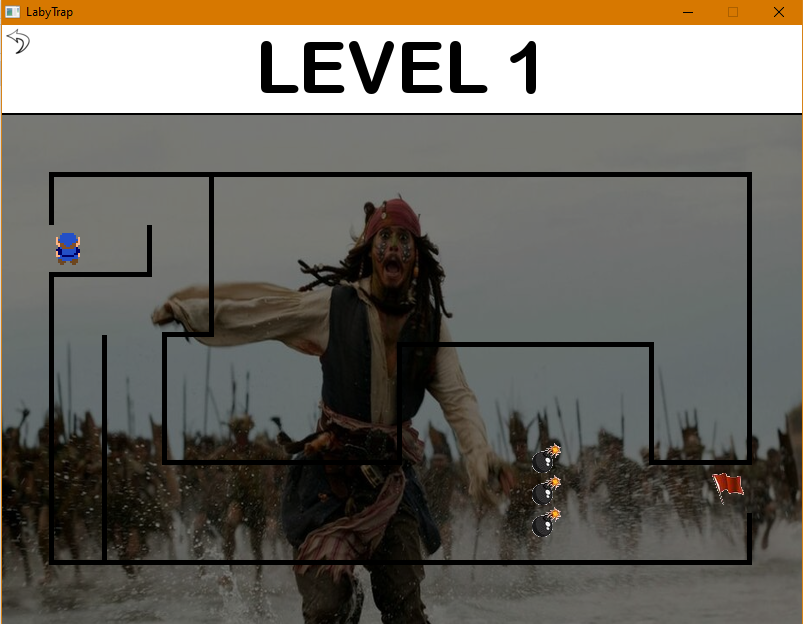

# LABY TRAP PROJECT

## Description 
LabyTrap is a game developed in language 'C' via the "allegro 5" library which consists of getting out of 
the labyrinth by avoiding the traps.

## Presentation
#### Picture 1 : Menu of game

#### Picture 2 : Level Menu

#### Picture 3 : Level 1

#### Picture 4 : Level 1 (2)
.PNG)

## VERSI0NING

Versioning in my git repository goes like this : 

- In the branch : master 
        -> Final version.

- In the branch : files
        -> The files of the allegro 5 library and subject.

- In the tags : v1.0
        -> Optimization code.

- In the tags : v0.9
        -> Programming Makefile.

- In the tags : v0.8
        -> Programming of traps and add decoration.

- In the tags : v0.7
        -> Collision of objects.

- In the tags : v0.6
        -> Programming of the character movement.
        

- In the tags : v0.5
        -> Labyrinth creation (Level 1).

- In the tags : v0.4
        -> Level menu coding.

- In the tags : v0.3
        -> Add music and complete menu.

- In the tags : v0.2
        -> Game menu coding.

- In the tags : v0.1
        -> Game window preparation ready.

## USE OF THE ALLEGRO 5 LIBRARY

### INSTALLATION

- For CodeBlocks : 
        https://www.allegro.cc/files/ ->
        MinGW 4.7.0 / allegro-5.0.10-mingw-4.7.0.zip.

- For Visual Studio : 
        https://www.allegro.cc/files/ ->
        MSVC 11 / allegro-5.0.10-msvc-11.0.zip

- Easy installation : 
        Allegro 5 available in the "files" branch for CodeBlock and Visual Studio.

### POSITIONING OF DLL

- Solution 1 : 
        Copy the DLL to the executable directory.

- Solution 2 : 
        Copy the DLL to the appropriate system folder 
        (C:\Windows\SysWOW64 -> 64 bit or C:\Windows\System32 -> 32 bit).

- Solution 3 : 
        Use a static library.

### CONFIGURATION

- For CodeBlocks : 

        Menu Project -> Project build options -> Search directories (for debug and release) -> compiler
        (add include) -> Linker (add lib)

        Menu Project -> Project build options -> Linker settings (Debug) -> add 
        allegro-5.0.10-monolith-mt-debug -> Linker settings (Release) -> add 
        allegro-5.0.10-monolith-mt

- For Visual Studio :
        
        Create a project (Empty project)
        New file -> Visual C++ -> File C++ (.cpp)
        WARNING : Being in C++ will not affect the code later, because C is included in C++

        Go to the propeties : 
        
        Any configuration -> C/C++ -> General ->  Go to the other include directory -> Add folder include (allegro 5)
        Any configuration -> Link editor -> General -> Go to the additional library directories -> Add folder lib (allegro 5)

        Debug -> Link editor -> Input -> Additional outbuildings -> Add allegro-5.0.10-monolith-mt-degug.lib
        Release -> Link editor -> Input -> Additional outbuildings -> Add allegro-5.0.10-monolith-mt.lib 